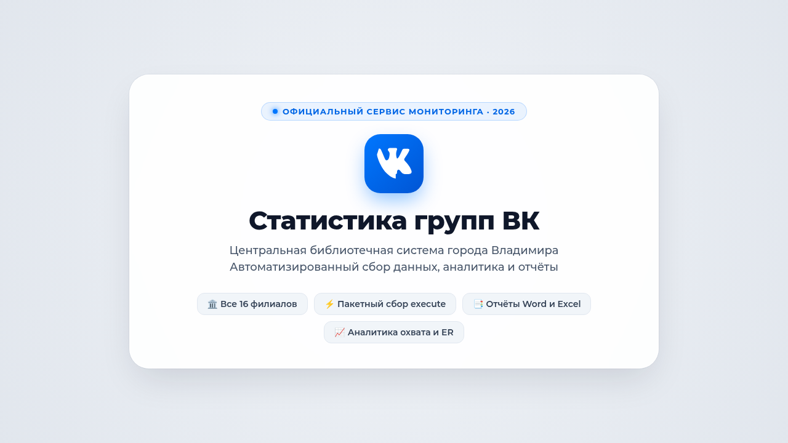
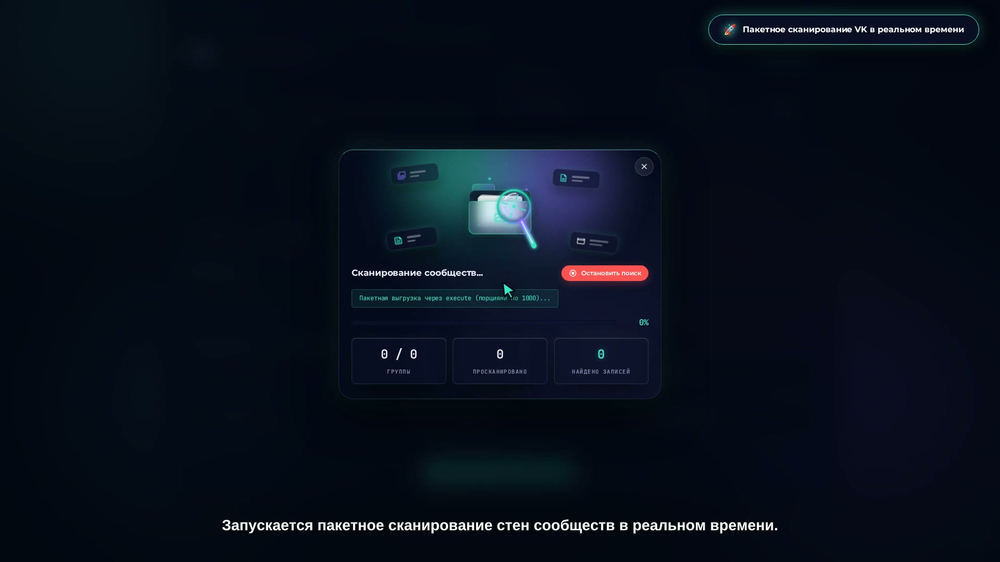
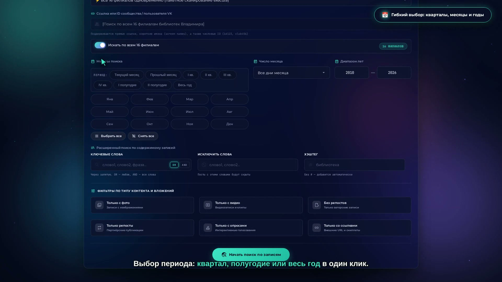
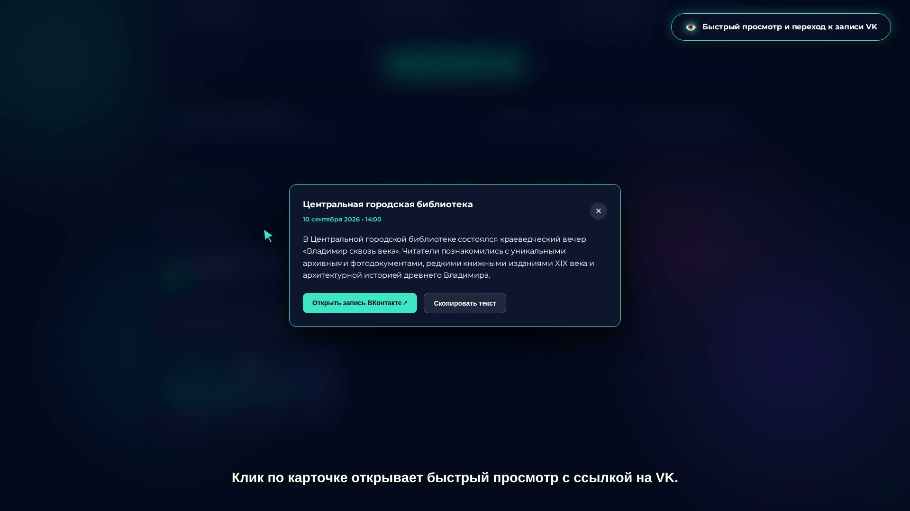
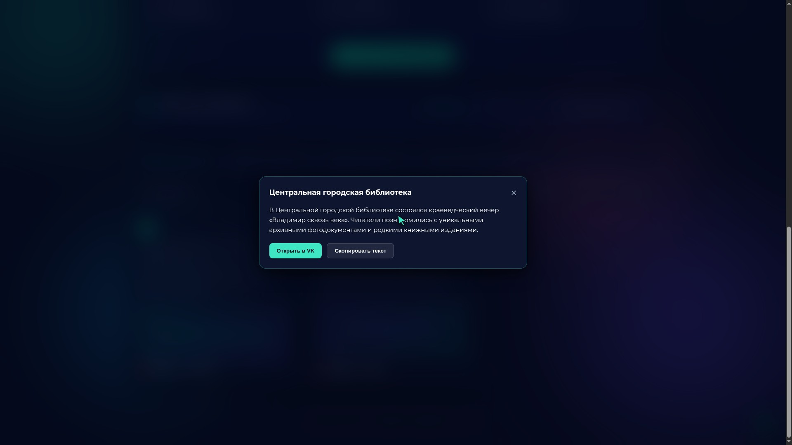
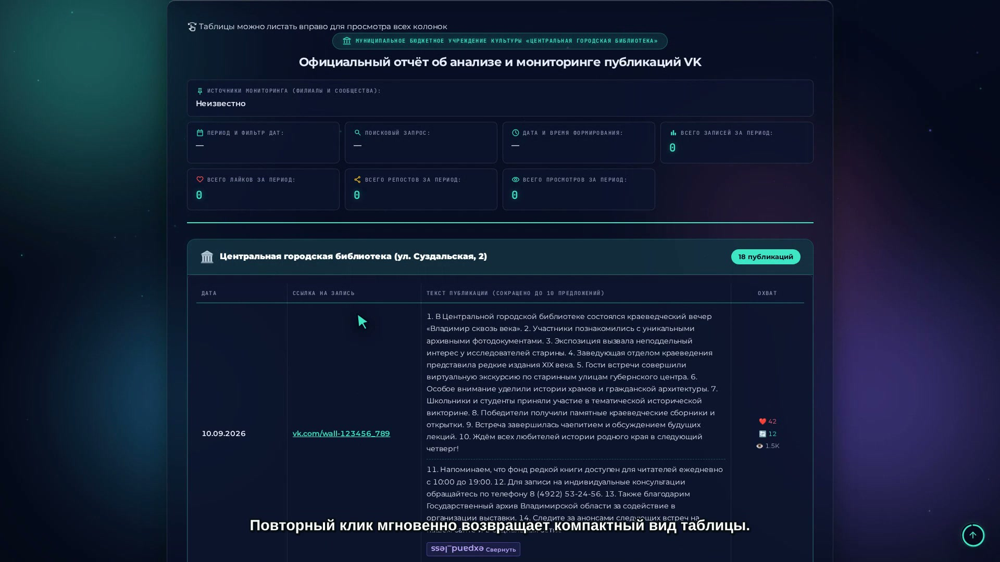
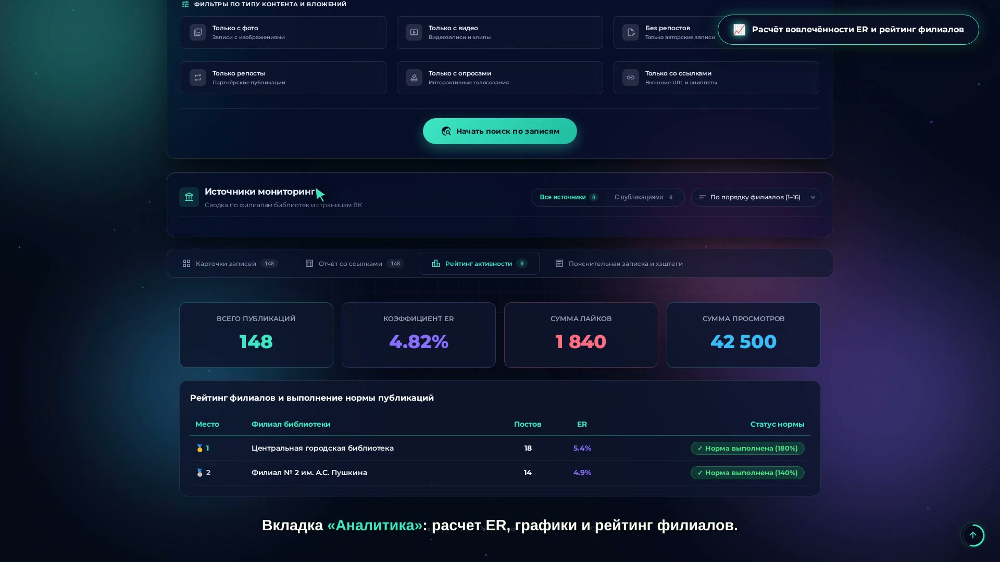
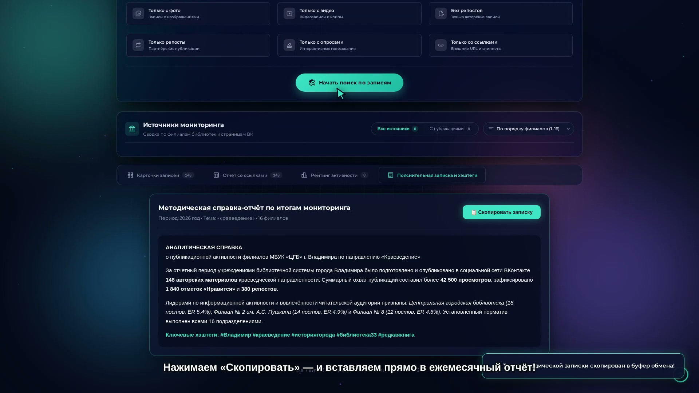
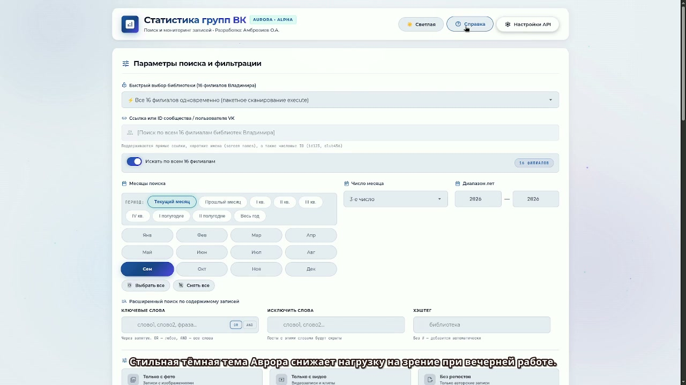

<div align="center">

# ⚡ Статистика групп ВК (VK Wall Searcher)
### Высокопроизводительная система мониторинга, аналитики и генерации отчётов VK API

[](https://php.net/)
[](https://dev.vk.com/)
[](#-архитектура-и-стек-технологий)
[](#-адаптивные-темы-оформления)
[](https://biblioteka33.ru/stat)
[](#-лицензия-и-авторство)

<br>

<p align="center">
  
</p>

<p align="center">
  <b>Комплексная веб-платформа мониторинга сообществ ВКонтакте для Центральной библиотечной системы г. Владимира.</b><br>
  Агрегация 16 филиалов, пакетное сканирование порциями до 1 000 постов за 1 запрос, расчёт вовлечённости (ER), интеллектуальное сокращение текстов, реестр ссылок и экспорт официальной отчётности.
</p>

[**🌐 Онлайн-версия системы**](https://biblioteka33.ru/stat) • [**🚀 Быстрый старт**](#-быстрый-старт-и-установка) • [**✨ Возможности**](#-ключевые-возможности) • [**⌨️ Горячие клавиши**](#️-горячие-клавиши)

</div>

---

## 📋 Оглавление

1. [О проекте](#-о-проекте)
2. [Ключевые возможности](#-ключевые-возможности)
   - [Пакетный сбор через VK API execute](#1-высокоскоростной-пакетный-сбор-vk-api-execute)
   - [Умный поиск и фильтрация](#2-умный-поиск-и-гибкая-фильтрация)
   - [Интерактивная визуальная лента](#3-интерактивная-визуальная-лента-публикаций)
   - [Официальный отчёт с ссылками](#4-официальный-отчёт-с-ссылками-и-детекцией-репостов)
   - [Аналитика активности и рейтинг ER](#5-аналитика-активности-и-рейтинг-вовлечённости-er)
   - [Автоматическая пояснительная записка](#6-автоматическая-пояснительная-записка-методиста)
   - [Адаптивные темы оформления](#7-адаптивные-темы-оформления)
3. [Экспорт и форматы данных](#-экспорт-и-форматы-данных)
4. [Горячие клавиши](#️-горячие-клавиши)
5. [Архитектура и стек технологий](#-архитектура-и-стек-технологий)
6. [Быстрый старт и установка](#-быстрый-старт-и-установка)
   - [Локальный запуск (PHP built-in server)](#1-локальный-запуск)
   - [Развертывание на веб-хостинге](#2-развертывание-на-веб-хостинге)
   - [Конфигурация Nginx + PHP-FPM](#3-сервер-nginx--php-fpm)
   - [Конфигурация Apache (.htaccess)](#4-сервер-apache--litespeed)
7. [Настройка сервисного токена VK](#-настройка-сервисного-токена-vk)
8. [Возможности версии 3.4: советы, подписчики, самообновление](#-возможности-версии-34)
8. [Лицензия и авторство](#-лицензия-и-авторство)

---

## 🎯 О проекте

Веб-приложение **«Статистика групп ВК» (VK Wall Searcher)** разработано для автоматизации аналитической и методической работы Центральной библиотечной системы (ЦБС) города Владимира.

Платформа решает критические задачи мониторинга и отчётности:
* **Экономия до 95% времени** сотрудников на составление ежемесячных и квартальных отчётов по социальным сетям.
* **Централизованный сбор** данных из 16 официальных пабликов филиалов библиотек города без ручного обхода страниц.
* **Объективная оценка эффективности** через автоматический расчёт Engagement Rate (ER), просмотров, охвата и реакций аудитории.
* **Абсолютная автономность**: работает на чистом PHP без Composer, Node.js или MySQL.

---

## ✨ Ключевые возможности

### 1. Высокоскоростной пакетный сбор (VK API `execute`)

Вместо сотен последовательных сетевых обращений система использует процедуру `execute` VK API, передавая кастомный VKScript-код. Это позволяет сканировать стены сообществ **порциями до 1 000 постов за один единственный HTTP-запрос**.

* Встроенный **Rate-Limiter** на базе атомарных файловых блокировок предотвращает превышение лимитов (`3 запроса/сек`) и защищает сервисный токен от блокировки.
* Всплывающее информационное окно отображает динамику сканирования по каждому филиалу в реальном времени.

<p align="center">
  
</p>

---

### 2. Умный поиск и гибкая фильтрация

Интуитивная панель управления позволяет настроить выборку с ювелирной точностью:

* **Пакетный выбор филиалов**: переключатель *«Выбрать все»* (16 библиотек) или точечный выбор конкретных филиалов.
* **Временные интервалы**: предустановки (текущий месяц, прошлый месяц, 1-й/2-й/3-й/4-й кварталы, текущий год), выбор года, месяца или **конкретного числа месяца**.
* **Контентные фильтры**: только с фото, с видео, со статьями, опросы, документы, репосты, **с ссылками**.
* **Полнотекстовый поиск**: ключевые фразы, логика совпадения («И» / «ИЛИ»), список слов-исключений.

<p align="center">
  
</p>

---

### 3. Интерактивная визуальная лента публикаций

Первая вкладка результатов — карточная лента с адаптивной сеткой.

* Быстрый визуальный просмотр медиа-вложений (фотогалереи, превью видео).
* Мгновенные счётчики вовлечённости: просмотры (👁️), лайки (❤️), репосты (🔄), комментарии (💬).
* Клик по любой карточке открывает детальное модальное окно с полным текстом записи, увеличенными изображениями и прямой ссылкой ВКонтакте.

<p align="center">
  
</p>

<p align="center">
  
</p>

---

### 4. Официальный отчёт с ссылками и детекцией репостов

Специализированный режим для методистов и руководителей учреждений:

* **Интеллектуальное сокращение текстов**: длинные публикации аккуратно форматируются максимум до 10 смысловых предложений. Алгоритм защищает от разрыва сокращения («г.», «ул.», «руб.», «др.»), календарные даты («15.03.2024 г.») и адреса сайтов.
* **Кнопка «Развернуть полностью»**: позволяет моментально прочитать полный текст прямо в таблице.
* **Интеллектуальная атрибуция репостов**: если запись является репостом, алгоритм распознаёт исходный паблик, подписывает филиал и генерирует прямую ссылку на первоисточник.
* **Лаконичные кнопки «ССЫЛКА»**: заменяют громоздкие URL-адреса на аккуратные кнопки.
* **Залипающая шапка таблицы**: заголовки колонок всегда остаются зафиксированными у верхнего края при любой глубине прокрутки.

<p align="center">
  
</p>

---

### 5. Аналитика активности и рейтинг вовлечённости (ER)

Глубокий срез результативности контента по каждому подразделению:

* Расчёт метрик **ER (Engagement Rate)**:
  $$\text{ER} = \frac{\text{Лайки} + \text{Репосты} \times 2 + \text{Комментарии} \times 3}{\text{Просмотры}} \times 100\%$$
* Сравнительная интерактивная диаграмма публикаций по филиалам.
* Сводная таблица «Выполнение плана по постам» с залипающим заголовком и сортировкой по ключевым показателям эффективности.

<p align="center">
  
</p>

---

### 6. Автоматическая пояснительная записка методиста

Вкладка формирует готовый официальный текст для включения в месячный или квартальный отчёт Управления культуры:

* Автоматическая фиксация периода: при выборе конкретного дня указывается точная дата; при выборе месяца — соответствующий месяц и год.
* Ключевые сводные цифры: количество проанализированных публикаций, суммарный охват просмотров, средний ER.
* Реестр уникальных внешних ссылок и популярные хэштеги периода.
* Быстрое копирование всего документа в буфер обмена одной кнопкой.

<p align="center">
  
</p>

---

### 7. Адаптивные темы оформления

Интерфейс спроектирован с заботой о зрении пользователя в любое время суток:

* **Aurora Glassmorphism (Тёмная тема)**: глубокий космический фон, неоновые акценты (Emerald, Cyan, Violet), эффект матового стекла (`backdrop-filter: blur`).
* **Platinum Slate (Светлая тема)**: выверенная серо-платиновая палитра, гармоничный тёмно-серый заголовок, адаптивные переключатели и кнопки без ядовитых оттенков.
* Переключение в 1 клик или клавишей `T`.

<p align="center">
  
</p>

---

## 📥 Экспорт и форматы данных

Все сформированные выборки можно экспортировать в 1 клик:

| Формат | Описание |
| :--- | :--- |
| 📋 **Буфер обмена** | Быстрое копирование таблицы или пояснительной записки для вставки в мессенджеры/почту |
| 📑 **Word (.docx / .doc)** | Полноценный документ для передачи руководству с таблицей и форматированием |
| 📊 **Excel / CSV** | Табличные данные с разделителями для дальнейшей обработки в электронных таблицах |
| 🌐 **Автономный HTML** | Готовый автономный интерактивный веб-отчёт со всеми стилями, открывающийся без сервера |
| 🗄️ **JSON** | Полная выгрузка сырых данных API для интеграции с внешними сервисами |

---

## ⌨️ Горячие клавиши

Для максимальной скорости работы в систему внедрены глобальные хоткеи:

* <kbd>Ctrl</kbd> + <kbd>Enter</kbd> / <kbd>Cmd</kbd> + <kbd>Enter</kbd> — Запуск поиска
* <kbd>1</kbd> — Вкладка «Лента постов»
* <kbd>2</kbd> — Вкладка «Отчёт с ссылками»
* <kbd>3</kbd> — Вкладка «Рейтинг активности»
* <kbd>4</kbd> — Вкладка «Пояснительная записка»
* <kbd>T</kbd> — Переключение темы (Тёмная / Светлая)
* <kbd>/</kbd> — Фокус в поле поискового запроса
* <kbd>?</kbd> — Открыть интерактивное руководство пользователя
* <kbd>Esc</kbd> — Закрыть любое открытое модальное окно

---

## 🏗️ Архитектура и стек технологий

```
vk_wall_searcher/
├── api/
│   ├── index.php             # Заглушка безопасности
│   └── vk-proxy.php          # Высокопроизводительный PHP-прокси к VK API + Rate Limiter
├── assets/
│   └── screenshots/          # Скриншоты и графические материалы документации
├── src/
│   ├── analytics.js          # Расчёт ER, сводная статистика, построение графиков
│   ├── api.js                # Клиентский сетевой слой и пакетные вызовы execute
│   ├── app.js                # Ядро приложения, маршрутизация состояний и событий
│   ├── branches.js           # Управление базой филиалов ЦБС и пресетами
│   ├── export.js             # Генераторы экспорта (DOCX, CSV, JSON, HTML, буфер)
│   └── render.js             # Рендеринг карточек, таблиц, модалок и сокращения текста
├── branches_cache.json       # Локальная база метаданных 16 филиалов библиотек
├── index.html                # Разметка SPA (Single Page Application)
├── index.php                 # Корневой маршрутизатор
├── app.js                    # Монолитный оптимизированный бандл скриптов
├── style.css                 # Полная таблица стилей Aurora Glassmorphism
├── run_server.sh             # Скрипт быстрого запуска для Linux / macOS
├── run_server.bat            # Скрипт быстрого запуска для Windows
└── .htaccess                 # Оптимизация Apache (Gzip, UTF-8, Rewrite)
```

* **Frontend**: Чистый Vanilla JavaScript (ES6+), современные CSS Custom Properties, Flexbox, CSS Grid. Отсутствие внешних зависимостей обеспечивает мгновенную загрузку интерфейса.
* **Backend**: Нативный PHP 7.4+ / 8.x. Автоматическое переключение между `cURL` и потоковым контекстом `file_get_contents`.
* **Защита от сбоев**: Файловый семафор ограничивает частоту запросов к API ВКонтакте, гарантируя стабильность даже при одновременной работе нескольких пользователей.

---

## 🚀 Быстрый старт и установка

### 1. Локальный запуск

Если у вас установлен PHP 7.4 или выше:

* **Linux / macOS**:
  ```bash
  git clone https://github.com/giddammit-crypto/vk-wall-searcher.git
  cd vk-wall-searcher
  chmod +x run_server.sh
  ./run_server.sh
  ```
  *(или напрямую: `php -S 0.0.0.0:8000`)*

* **Windows**:
  Дважды кликните по файлу `run_server.bat` или выполните в PowerShell:
  ```powershell
  php -S localhost:8000
  ```

Откройте в браузере: `http://localhost:8000`.

---

### 2. Развертывание на веб-хостинге

Приложение готово к работе на **любом хостинге** (Beget, Timeweb, Reg.ru, cPanel, чистый Nginx/Apache или статический хостинг GitHub Pages):

1. Скопируйте файлы репозитория в папку сайта (`public_html`, `www` или в любую подпапку, например `https://domain.ru/vk-wall-searcher/`).
2. **Никаких Node.js, Vite, npm или запуска `.bat`/`.sh` на хостинге НЕ ТРЕБУЕТСЯ!** Скрипты `.bat` и `.sh` предназначены исключительно для локального тестирования на вашем ПК.
3. Проект работает сразу «из коробки»: встроенные проверенные сервисные ключи уже настроены в системе. При необходимости свой ключ можно задать в `api/config.php` или прямо в веб-интерфейсе (кнопка «Ключ VK»).
4. На статическом хостинге (без PHP) проект автоматически переходит в автономный браузерный режим (JSONP).

---

### 3. Сервер Nginx + PHP-FPM

Пример конфигурационного файла виртуального хоста Nginx:

```nginx
server {
    listen 80;
    server_name vk-stat.example.com;
    root /var/www/vk_wall_searcher;
    index index.php index.html;

    charset utf-8;

    location / {
        try_files $uri $uri/ /index.php?$args;
    }

    location ~ \.php$ {
        include snippets/fastcgi-php.conf;
        fastcgi_pass unix:/run/php/php8.2-fpm.sock;
        fastcgi_param SCRIPT_FILENAME $document_root$fastcgi_script_name;
        include fastcgi_params;
    }

    location = /api/vk-proxy {
        rewrite ^ /api/vk-proxy.php last;
    }
}
```

---

### 4. Сервер Apache / LiteSpeed

Файл `.htaccess` уже настроен в репозитории:
* Автоматическое включение кодировки `UTF-8`.
* Проксирование запросов к API.
* Gzip-сжатие текстовых ресурсов для ускорения отдачи интерфейса.

---

## 🔑 Настройка сервисного токена VK

Начиная с версии **3.3** сервисный ключ доступа хранится **только на сервере** — в файле `api/config.php`. Браузер пользователя ключ не получает и не передаёт; поле ввода токена из интерфейса удалено.

Подключение собственного ключа:

1. Перейдите в [Панель управления приложениями VK](https://dev.vk.com/admin/apps-list).
2. Создайте приложение типа **Standalone** или используйте существующее.
3. В разделе **«Настройки»** скопируйте **«Сервисный ключ доступа»** (Service token).
4. Скопируйте шаблон конфигурации и впишите ключ:
   ```bash
   cp api/config.example.php api/config.php
   ```
   ```php
   return [
       'vk_service_token'          => 'ваш_сервисный_ключ',
       'vk_service_token_fallback' => 'резервный_ключ_необязательно',
       'api_version'               => '5.131',
   ];
   ```

Особенности серверного хранения:

* **Ключ не виден клиенту** — прокси `api/vk-proxy.php` подставляет его самостоятельно; индикатор в интерфейсе показывает только факт настроенности ключа.
* **Резервный ключ** — если основной ключ отозван и VK возвращает ошибку авторизации (`error_code 5`), прокси автоматически повторяет запрос с ключом `vk_service_token_fallback`.
* **Проверка статуса** — `GET /api/vk-proxy.php?status=1` возвращает доступность ключей без раскрытия их значений.
* Файл `api/config.php` внесён в `.gitignore` и не попадает в репозиторий.

---

## 🆕 Возможности версии 3.4

### 💡 Вкладка «Советы филиалам»

После каждого сканирования система автоматически строит персональные рекомендации для каждого филиала на основе правил методиста:

* частота публикаций (постов в неделю относительно нормы 2–4);
* вовлечённость (ER) и охват относительно числа подписчиков;
* доля записей с хэштегами и иллюстрациями;
* равномерность публикаций по дням недели и лучшее время постинга по фактическим просмотрам;
* баланс лайков и комментариев;
* динамика подписчиков (если накапливается история).

По каждому филиалу выводится «индекс здоровья» (0–100) и список замечаний четырёх уровней: отлично / к сведению / внимание / проблема.

### 📈 Вкладка «Подписчики» — подписки и отписки

История числа подписчиков накапливается **на сервере** (`data/subscribers.json`, не более одного снимка на сообщество в день):

* снимки сохраняются автоматически после каждого сканирования и по кнопке **«Снять свежие показатели»**;
* таблица по филиалам с дельтами **за 24 часа / 7 дней / 30 дней** и числом накопленных снимков;
* KPI-карточки: суммарная аудитория, дни наблюдений, чистый прирост за неделю и месяц;
* SVG-график суммарной аудитории всех филиалов по дням;
* очистка истории — в окне «Настройки».

### ⚙️ Кнопка «Настройки»

Шестерёнка в шапке открывает окно настроек приложения:

* статус сервисного ключа VK (ключ хранится на сервере, см. `api/config.php`);
* проверка и установка обновлений с GitHub;
* управление историей подписчиков;
* текущая версия и коммит.

### 🔄 Самообновление с GitHub

Раздел «Обновления с GitHub» в окне настроек:

1. **«Проверить обновления»** сравнивает локальный коммит (`.version.json`) с актуальным коммитом ветки `main` репозитория (кэш результата — 6 часов). При появлении новой версии на кнопке «Настройки» загорается точка-индикатор.
2. **«Установить обновление»** скачивает архив ветки и **сразу применяет** его поверх файлов приложения (без перезагрузки сервера — новые версии PHP-эндпоинтов и интерфейса подхватываются со следующего запроса).
3. Установка защищена паролем `update_token` из `api/config.php`; при обновлении **никогда не затираются** `api/config.php` (секреты) и каталог `data/` (история подписчиков и состояние апдейтера).

Параметры репозитория (`github_repo`, `github_branch`, `update_token`, необязательный `github_token`) задаются в `api/config.php`.

---

## 🩺 Версия 3.4.1 — аудит производительности и UX

* **Сканирование ускорено в разы**: ликвидирован «тихий» фолбэк на медленный последовательный `wall.get` — при ошибке VK 13 («response size is too big») execute автоматически повторяется с меньшими порциями (100×5 → 50×5 → 25×5). Полное сканирование 16 филиалов: ~3 минуты вместо «не завершалось».
* **Дефолт периода**: последние 2 года вместо 2010+ — отчёты формируются быстрее, глубокий архив доступен явным расширением диапазона лет.
* **Живые данные сообществ**: аватары и счётчики подписчиков подтягиваются одним батч-запросом `groups.getById` (ранее fast-path каталога отдавал цели без них — снимки подписчиков не сохранялись).
* **Адаптивность**: исправлен наезд кнопок шапки на логотип на экранах ≤600px (иконки в один ряд), доводка 600–900px; сетки советов/подписчиков на узких экранах.
* **Дизайн/UX**: эмодзи темы заменены на Material Symbols (кроссплатформенно), липкая панель вкладок при длинной ленте, баланс колонок блока дат.
* **Доступность**: видимый focus-ring для клавиатуры, `prefers-reduced-motion`, сенсорные цели ≥44px.
* **Производительность**: `preconnect` к шрифтовым доменам, `content-visibility: auto` для карточек и невидимых вкладок.

## 🛰️ Версия 3.9.0 — фотореалистичный космос и «Кольцо Героев»

Пространство «Пространство» (3D-режим) переведено на физическую модель света.

### Солнце и лучи
* **Физический диск** — угловой радиус 0.2665°, потемнение к краю
  `I(μ) = 1 − 0.62(1 − μ)`, HDR-радианс 46: ядро пересвечивается, как в
  настоящем объективе. Земля и Луна **по-настоящему закрывают** Солнце —
  перекрытие считает глубинный тест, а не ручной коэффициент.
* **Оптика объектива** (`src/sun_optics.js`): вуаль рассеяния с физическим
  спадом (ядро ∝ x⁻²·², широкая дымка ∝ x⁻⁰·⁵⁵), шесть лучей диафрагмы,
  анаморфная полоса с дисперсией и цепочка призраков линз с хроматическим
  сдвигом. Всё запекается в спрайтовый атлас — в кадре ~10 `drawImage` в
  режиме `lighter`, что не мешает 60 FPS.
* **HDR-пайплайн**: сцена рендерится в `rgba16f`, затем bright-pass с «мягким
  коленом» → двухфильтровая пирамида bloom (5 уровней) → ACES → виньетка
  cos⁴, зерно с дизерингом и хроматическая аберрация.
* **Автоэкспозиция «глаза»**: пока Солнце в кадре, сцена притемняется — как
  при реальной переадаптации зрения.

### Звёзды
* `src/starfield.js` — каталог по физике, а не по случайным точкам:
  степенная функция светимости `N(>F) ∝ F⁻¹·⁵`, цвет фотосферы по Планку
  (2400…32000 K), размер пятна рассеяния растёт с потоком, дифракционные
  лучи — только у ярчайших звёзд. Млечный Путь получает тёплое ядро,
  голубоватые рукава и Великий Разлом.
* В вакууме звёзды **не мерцают** — сцинтилляция возможна только в
  атмосфере; остаётся микродрожание оптики.
* Каталог общий для GPU и CPU-фолбэка, поэтому картинка совпадает.

### «Кольцо Героев Космоса»
* Данные о 16 космонавтах переехали из выдвигающейся панели прямо в
  3D-пространство: **1 окно = 1 карточка** с фотографией, биографией,
  цитатой и плитками статистики.
* Карточки стоят по окружности и **делают полный круг (360°)** перед
  пользователем с разгоном и торможением, после чего останавливаются на
  герое. Возобновление — через 9 секунд покоя, либо вручную (стрелки, HUD).
* Портреты — отдельный HD-набор `assets/cosmonauts_hd/` (660×880,
  ленивая загрузка).
* Полный текстовый реестр по-прежнему доступен из HUD кольца — ни одна
  функция старой панели не потеряна.

## 🧠 Версия 3.4.2 — глубокая аналитика и профессиональные отчёты

* **Подписчики с первого сканирования**: первый запуск собирает базовые данные по всем филиалам (баннер «базовая точка»), каждое следующее сканирование показывает прирост/отток по конкретному филиалу за сутки, 7 и 30 дней.
* **Исправлен совет «Лучшее время»**: устранена ошибка разбора счётчиков ВК (просмотры показывались как 0); совет выдаётся только при статистически значимых данных и указывает процент превышения над средним по филиалу. Добавлен совет по лучшему дню недели.
* **20+ правил рекомендаций**: «мёртвые периоды» (паузы >7/14 дней), динамика ER (первая и вторая половина периода), доля репостов, фирменные хэштеги, SEO-словарь («книги», «мероприятия», «Владимир»…), ссылки на сайт, видео/клипы, опросы, закреплённая запись, длина текстов, публикации в часы активности, охват и подписчики. Индекс здоровья пересчитан по новой шкале.
* **Профессиональный DOC-отчёт**: сводная таблица KPI по всем филиалам (включая нулевые), раздел «Динамика подписчиков», корректные суммарные показатели в паспорте отчёта, блок «Отчёт составил / Подпись / Дата», поля страницы A4.
* **Светлая тема**: исправлен контраст кнопок и текста в кнопках, ховеров, бейджей вкладок и активных пилюль периодов.
* **Справка**: убран пункт «Настройте API» — сервисный ключ предустановлен на сервере.

---

## 📄 Лицензия и авторство

* **Разработчик**: Амброзиев О. А.
* **Организация**: МБУК «Центральная городская библиотека» г. Владимира ([biblioteka33.ru](https://biblioteka33.ru))
* **Лицензия**: Данный проект распространяется под свободной лицензией [MIT](LICENSE).

<div align="center">
  <sub>Сделано с заботой о библиотечном деле и культуре г. Владимира ❤️</sub>
</div>
