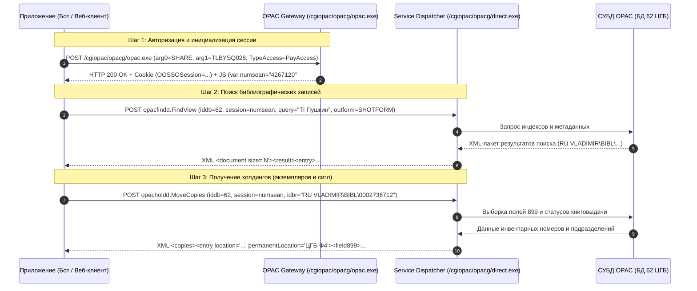

# ЭТАЛОННАЯ СПЕЦИФИКАЦИЯ ЭЛЕКТРОННОГО КАТАЛОГА OPAC-GLOBAL (БД 62: ЦГБ Г. ВЛАДИМИРА)

> **Статус документа:** Действующий эталонный стандарт интеграции  
> **Организация:** Муниципальное бюджетное учреждение культуры «Центральная городская библиотека» г. Владимира (МБУК «ЦГБ»)  
> **Целевая аудитория:** Ведущий программист, Фулстак-инженер, Библиотечные каталогизаторы, Разработчики чат-бота и веб-виджетов  
> **Хост каталога:** `https://opac.lib33.ru` (АБИС OPAC-Global, разработчик ООО «ДИТ-М»)  
> **Идентификатор БД:** `62` («Электронный каталог ЦГБ г. Владимира», объем: ~200 000 записей)

---

## 1. Архитектура и протокол взаимодействия с OPAC-Global

АБИС OPAC-Global использует трехуровневую архитектуру: сервер баз данных на платформе СУБД (PostgreSQL / Intersystems Cache / Oracle), шлюзовой сервер приложений CGI/FastCGI (`opac.exe`, `direct.exe`), и клиентский Web-интерфейс.



### 1.1. Аутентификация и управление сессиями
Для выполнения вызовов сервисов каталога требуется действующая сессия. Читательский доступ без ограничений осуществляется через гостевой профиль `SHARE`:

- **URL входа:** `https://opac.lib33.ru/cgiopac/opacg/opac.exe`
- **Метод:** `POST`
- **Content-Type:** `application/x-www-form-urlencoded; charset=utf-8`
- **Тело запроса:**
  ```
  arg0=SHARE&arg1=TLBYSQ028&TypeAccess=PayAccess
  ```
- **Извлечение параметров сессии:**
  1. Из заголовка `Set-Cookie`: `OGSSOSession=<hex_token>` (сохранять для всех последующих вызовов).
  2. Из HTML-тела ответа с помощью регулярного выражения:
     ```javascript
     var numsean = "([0-9]+)";
     ```
     Числовое значение `numsean` (например, `4267120`) передается в качестве параметра `session` в диспетчер сервисов `direct.exe`.

### 1.2. Диспетчер прямых сервисных запросов (`direct.exe`)
Все специализированные вызовы каталогизации, поиска и циркуляции экземпляров направляются на единую конечную точку:
- **URL диспетчера:** `https://opac.lib33.ru/cgiopac/opacg/direct.exe`
- **Обязательные заголовки:**
  * `Cookie: OGSSOSession=<hex_token>`
  * `Content-Type: application/x-www-form-urlencoded`
  * `User-Agent: Mozilla/5.0 (Windows NT 10.0; Win64; x64) AppleWebKit/537.36`

---

## 2. Спецификация сервиса поиска `opacfindd.FindView`

Сервис выполняет поиск в каталоге и возвращает сформированные библиографические записи.

### 2.1. Параметры POST-запроса
| Параметр | Тип | Значение для БД 62 | Описание |
|---|---|---|---|
| `_service` | string | `opacfindd.FindView` | Системный идентификатор сервиса поиска |
| `_version` | string | `2.7.0` (поиск) / `2.3.0` (по ID) | Версия XML-схемы |
| `userId` | string | `SHARE` | Логин пользователя сессии |
| `session` | string | `{numsean}` | Числовой маркер сессии из `opac.exe` |
| `iddb` | integer | `62` | Идентификатор БД ЦГБ г. Владимира |
| `query/body` | string | `TI Капитанская дочка` | Поисковое выражение с префиксом индекса |
| `query/mode` | string | `wordset` | `wordset` (слова в любом порядке) или `context` (строгая фраза) |
| `start` | integer | `0` | Смещение (0-индексированное) для пагинации |
| `length` | integer | `10` | Количество возвращаемых записей в порции |
| `outformList[0]/outform` | string | `SHOTFORM` | Формат вывода: `SHOTFORM`, `UNIMARC`, `BIBCARD` |
| `outformList[1]/outform` | string | `LINEORD` | Порядок и правила циркуляции |

#### Основные префиксы поисковых индексов:
- `TI <заглавие>` — Поиск по заглавию книги;
- `AU <автор>` — Поиск по фамилии автора;
- `FT <фраза>` — Сквозной поиск по всем полям библиографической записи;
- `KW <ключевые слова>` — Поиск по ключевым словам и предметным рубрикам;
- `FD <сигла>` — Фильтр по местонахождению (фонду) экземпляра (например, `FD 'Ф4'` или `FD 'АБ'`).

### 2.2. Формат краткой записи `SHOTFORM` (`FindView`)
При запросе `outformList[0]/outform = SHOTFORM` сервис возвращает XML с блоком `<SHOTFORM><content>`:

```xml
<document maxLastResult="90000" size="211">
  <result>
    <entry archive="false" controlType="UNDEFINE" id="RU VLADIMIR\BIBL\0002736712" iddb="62" isn="4758324" level="Full" resourceType="BIBLIO" sourceIddb="62" status="NEW">
      <LINEORD>
        <entry>043</entry>
        <entry>044</entry>
        <entry>057</entry>
        <entry>080</entry>
      </LINEORD>
      <SHOTFORM>
        <content>
          <entry>Глинка В.М., Пушкин и Военная галерея Зимнего дворца: биография коллективная - 1988.- 238 с., [8] л. ил.c.</entry>
          <entry>Однотомник муниципальной библиотеки. </entry>
          <entry>Шифр 63.3(2)л6; Авт. знак Г54; Инв.номер 48006; Место хранения: ф4</entry>
        </content>
        <action>
          <entry id="SEE6" title="Движение экземпляров"/>
        </action>
      </SHOTFORM>
    </entry>
  </result>
</document>
```

#### Правила извлечения данных из `SHOTFORM`:
1. **Идентификатор записи:** атрибут `entry/@id` (например, `RU VLADIMIR\BIBL\0002736712`).
2. **Элемент 0 (`content/entry[0]`):** Комплексная библиографическая строка.
   - *Парсинг автора:* подстрока до первой запятой (если автор указан в начале): `^([^,]+),` -> `Глинка В.М.`
   - *Парсинг заглавия:* текст между автором и тире перед годом: `,\s*(.+?)\s*-\s*\d{4}\.` -> `Пушкин и Военная галерея Зимнего дворца: биография коллективная`
   - *Основное заглавие и подзаголовок:* разделяются двоеточием `:` (`Пушкин и Военная галерея Зимнего дворца` / `биография коллективная`).
   - *Год издания:* 4 цифры перед точкой-тире: `-\s*(\d{4})\.-` -> `1988`.
   - *Пагинация (объем):* часть после года `\d{4}\.-\s*(.+)$` -> `238 с., [8] л. ил.c.`
3. **Элемент 1 (`content/entry[1]`):** Тип издания / библиографический уровень (`Однотомник муниципальной библиотеки.`, `Многотомник.`, `Ноты`).
4. **Элемент 2 (`content/entry[2]`):** Каталожные шифры и предварительные сигла филиалов:
   - `Шифр ([^;]+)` -> Индекс ББК (`63.3(2)л6`);
   - `Авт\. знак ([^;]+)` -> Авторский знак по таблице Хавкиной (`Г54`);
   - `Инв\.номер ([^;]+)` -> Инвентарный номер первого учтенного экземпляра (`48006`);
   - `Место хранения:\s*([^;\n]+)` -> Список сигл филиалов через запятую (`ф4`, `аб, чз, ф2, ф12`).

---

## 3. Спецификация сервиса холдингов `opacholdd.MoveCopies`

Сервис `opacholdd.MoveCopies` (в интерфейсе ОПАК обозначен действием `action="SEE6"`) является **главным источником данных об экземплярах, физическом размещении, доступности и инвентарном учете**.

### 3.1. Параметры POST-запроса
| Параметр | Тип | Значение | Описание |
|---|---|---|---|
| `_service` | string | `opacholdd.MoveCopies` | Имя сервиса циркуляции документов |
| `_version` | string | `1.0.0` | Версия протокола |
| `idbr` | string | `RU VLADIMIR\BIBL\0002736712` | Точный идентификатор записи из `FindView` |
| `iddb` | integer | `62` | Идентификатор БД ЦГБ г. Владимира |
| `id` | string | `SHARE` | Логин |
| `userId` | string | `SHARE` | Логин |
| `session` | string | `{numsean}` | Номер активной сессии |

### 3.2. Структура XML-ответа `MoveCopies`
```xml
<?xml version="1.0" encoding="utf-8" standalone="no" ?>
<document found="1" free="0" freeED="#" idEC="" idbr="RU VLADIMIR\BIBL\0002736712" iddb="62" outform="Глинка В.М.&#xA;Пушкин и Военная галерея Зимнего дворца.- Л.: Лениздат, 1988" status="NEW">
  <copies>
    <entry act="" barcode="NO" code1="48006" code2="NO" codeLocation="0" copy="48006 / NO" holder="FUND" inventory="48006" location="В хранении: ЦГБ-Ф4  (Экземпляр не доступен для книговыдачи)" number="0" permanentLocation="ЦГБ-Ф4" policy="" shifr="63.3(2)л6" status="1">
      <field899>
        <entry sub="a" value="ЦГБ Г. ВЛАДИМИРА"/>
        <entry sub="b" value="ф4"/>
        <entry sub="h" value="63"/>
        <entry sub="i" value="Г54"/>
        <entry sub="j" value="63.3(2)л6"/>
        <entry sub="p" value="NO"/>
        <entry sub="x" value="48006"/>
        <entry sub="y" value="1988/19"/>
        <entry sub="9" value="0.90"/>
      </field899>
    </entry>
  </copies>
</document>
```

### 3.3. Таблица извлечения атрибутов экземпляра (`copies/entry`)
| Атрибут / Тег | Описание в OPAC-Global | Назначение и правила интерпретации |
|---|---|---|
| `inventory` | Инвентарный номер | Уникальный инвентарный номер экземпляра в ЦБС (дублируется в `code1` и `field899 $x`). |
| `barcode` | Штрихкод / RFID | Значение `NO` указывает на традиционный учет без RFID; цифровое значение (10-13 знаков) — штрихкод/RFID-метка для станций самообслуживания. |
| `shifr` | Шифр расстановки | Расстановочный индекс книги на полке в данном филиале (например `63.3(2)л6`, `Р1`, `ср И(Вел)`). |
| `permanentLocation` | Постоянное место хранения | Сигла фонда с префиксом `ЦГБ-` (например `ЦГБ-Ф4`, `ЦГБ-АБ`, `ЦГБ-Ф13Н`, `ЦГБ-Ф2Д`, `ЦГБ-ДО`). |
| `location` | Текущий статус и размещение | Текстовая расшифровка статуса: `В хранении: ЦГБ-Ф4 (Экземпляр не доступен для книговыдачи)` или `В хранении: ЦГБ-АБ ЦГБ (АБ)`. |
| `status` | Числовой код доступности | `1` — Экземпляр в фонде/на полке; `2` — На руках у читателя; `3` — Забронирован; `DELETED` — Исключен/списан. |
| `document/@found` | Всего экземпляров | Общее количество зарегистрированных физических копий. |
| `document/@free` | Доступно экземпляров | Количество экземпляров, доступных для мгновенной выдачи. |
| `document/@outform` | Краткое описание | Стандартизованное описание книги с городом и издательством: `Л.: Лениздат, 1988`. |

### 3.4. Структура подполей машиночитаемого блока `field899`
Блок `<field899>` в точности соответствует библиотечному стандарту локальных полей RUSMARC/UNIMARC для автоматизированных систем:
- **`sub="a"` (Организация):** Учреждение-фондодержатель (`ЦГБ Г. ВЛАДИМИРА`, `ЦГБ г. Владимира`);
- **`sub="b"` (Сигла подразделения):** Точный код филиала или отдела (`ф4`, `ф13н`, `ф2д`, `аб`, `чз`, `до`, `кх`, `цдб`);
- **`sub="h"` (Раздел классификации):** Укрупненный индекс ББК (например `63` для истории, `84` для худ. лит-ры, `Р1` для русской классики);
- **`sub="i"` (Авторский знак):** Двузначный/трехзначный знак по таблице Хавкиной (например `Г54`, `Т 53`);
- **`sub="j"` (Шифр хранения):** Полный классификационный индекс (например `63.3(2)л6`);
- **`sub="p"` (Баркод/RFID):** Номер электронной метки или `NO`;
- **`sub="x"` (Инвентарный номер):** Номер инвентарной книги;
- **`sub="y"` (Акт поступления):** Год и порядковый номер акта (КСУ), например `1988/19` или `1995/23`;
- **`sub="9"` (Стоимость):** Балансовая цена книги в рублях на момент постановки на бухгалтерский учет (например `0.90`, `150.00`, `6000.00`).

---

## 4. Спецификация полей библиографической записи (RUSMARC / UNIMARC)

При вызове `FindView` с `outformList[0]/outform = UNIMARC` база данных 62 возвращает структурированный ISO/МАРК-протокол:

```xml
<UNIMARC>
  <entry>200 1#$fВ.М. Глинка$aПушкин и Военная галерея Зимнего дворца$eбиография коллективная</entry>
  <entry>210 ##$aЛ.$cЛениздат$d1988</entry>
  <entry>215 ##$a238 с., [8] л. ил.c.$d17</entry>
  <entry>686 ##$a63.3(2)л6$2rubbk$vLBC/RL</entry>
  <entry>700 #1$aГлинка$bВ.М.$gВладислав Михайлович</entry>
  <entry>899 ##$aЦГБ Г. ВЛАДИМИРА$bф4$h63$iГ54$j63.3(2)л6$pNO$x48006$y1988/19$90.90</entry>
</UNIMARC>
```

### 4.1. Карта библиотечных полей
| Тег MARC | Название поля | Подполе | Библиотечное значение и правила обработки |
|---|---|---|---|
| **200** | Заглавие и ответственность | `$a` | **Основное заглавие книги** (обязательное поле). |
| | | `$e` | **Сведения, относящиеся к заглавию** (жанр, подзаголовок). |
| | | `$f` | **Первые сведения об ответственности** (автор в форме: `И.О. Фамилия`). |
| | | `$g` | **Последующие сведения об ответственности** (соавторы, переводчики). |
| | | `$v` | **Номер тома / части** для многотомных изданий. |
| **700** | Индивидуальный автор | `$a` | **Фамилия автора** (точка доступа, например `Глинка`). |
| | | `$b` | **Инициалы автора** (например `В.М.`). |
| | | `$g` | **Полные имя и отчество** (например `Владислав Михайлович`). |
| | | `$4` | Код функции/роли (например `070` — автор). |
| **701 / 702** | Соавторы и редакторы | `$a`, `$b` | Вторичные авторы, составители, редакторы. |
| **210** | Издание и публикация | `$a` | **Место издания (город)** (`Владимир`, `Москва`, `Л.`, `СПб.`). |
| | | `$c` | **Наименование издательства** (`Лениздат`, `Просвещение`, `АСТ`). |
| | | `$d` | **Год издания** (4 цифры: `1988`, `2024`). |
| **215** | Физическая характеристика | `$a` | **Объем** (`238 с., ил.`). |
| | | `$d` | Размер книги в см (`17`). |
| **010** | Международный номер | `$a` | **ISBN** книги (10 или 13 знаков без дефисов). |
| **686** | Классификационный шифр | `$a` | **Индекс ББК** (Библиотечно-библиографическая классификация). |
| | | `$2` | Система классификации: `rubbk`. |
| **899** | Локальный экземпляр | `$a`..`$9` | Экземплярные данные (см. раздел 3.4). |

---

## 5. Полный эталонный словарь библиотечных сигл филиалов г. Владимира

Каталог ЦГБ г. Владимира кодирует подразделения в подполе `899 $b`, поисковом индексе `FD`, строке `SHOTFORM` и атрибуте `permanentLocation`. 

Ниже приведена **полная каноническая таблица декодирования** с географической и районной привязкой:

| Сигла в каталоге | Варианты и суффиксы | Каноническое название | Официальный адрес | Район г. Владимира | Телефон | Район «Доброе»? | Исторический центр? |
|---|---|---|---|---|---|:---:|:---:|
| **`аб`** | `ЦГБ-АБ`, `ФАБ` | Центральная городская библиотека, Абонемент | Суздальский пр., д. 2 | **жилой район «Доброе»** | 8(4922) 21-65-63, 21-66-80 | **ДА** | Нет |
| **`чз`** | `ЦГБ-ЧЗ` | Центральная городская библиотека, Читальный зал | Суздальский пр., д. 2 | **жилой район «Доброе»** | 8(4922) 21-65-63, 21-66-80 | **ДА** | Нет |
| **`кх`** | `ЦГБ-КХ` | Центральная городская библиотека, Книгохранилище | Суздальский пр., д. 2 | **жилой район «Доброе»** | 8(4922) 21-65-63 | **ДА** | Нет |
| **`ибо`** | `ЦГБ-ИБО` | Центральная городская библиотека, ИБО | Суздальский пр., д. 2 | **жилой район «Доброе»** | 8(4922) 21-65-63 | **ДА** | Нет |
| **`ооо`** | `ЦГБ-ООО` | Центральная городская библиотека, Отдел обслуживания | Суздальский пр., д. 2 | **жилой район «Доброе»** | 8(4922) 21-65-63 | **ДА** | Нет |
| **`до`** | `ЦГБ-ДО` | Центральная детская библиотека (Детский отдел) | ул. Большая Московская, д. 31 | **Исторический центр** | 8(4922) 32-32-42, 32-47-73 | Нет | **ДА (ЦДБ)** |
| **`цдб`** | `ЦГБ-ЦДБ`, `цдч`, `цди`, `цки` | Центральная детская библиотека | ул. Большая Московская, д. 31 | **Исторический центр** | 8(4922) 32-32-42, 32-47-73 | Нет | **ДА (ЕДИНСТВЕННАЯ!)** |
| **`ф1`** | `ЦГБ-Ф1`, `ф1д` | Библиотека — филиал №1 | проспект Строителей, д. 38 а, кв. 44 | Черёмушки / ВлГУ | 8(4922) 33-86-23 | Нет | Нет |
| **`ф2`** | `ЦГБ-Ф2`, `ф2д` (детский) | Библиотека — филиал №2 | пр. Ленина, д. 12 | Садовая площадь / «Заря» | 8(4922) 32-15-84, 32-15-85 | Нет | Нет |
| **`ф3`** | `ЦГБ-Ф3`, `ф3сд` | Библиотека — филиал №3 | мкр. Юрьевец, ул. Школьный проезд, д. 4 | мкр. Юрьевец | 8(4922) 26-18-74 | Нет | Нет |
| **`ф4`** | `ЦГБ-Ф4`, `ф4д` (детский) | Библиотека — филиал №4 | ул. Егорова, д. 10 | **жилой район «Доброе»** | 8(4922) 21-96-11; 21-23-48 | **ДА (КРИТИЧЕСКИ!)** | Нет |
| **`ф5`** | `ЦГБ-Ф5`, `ф5д` (детский) | Библиотека — филиал №5 | ул. Верхняя Дуброва, д. 10 | ЮЗР / Верхняя Дуброва | 8(4922) 54-28-43 | Нет | Нет |
| **`ф6`** | `ЦГБ-Ф6` | Библиотека — филиал №6 | мкр. Юрьевец, Институтский гор., д. 2 | мкр. Юрьевец | 8(4922) 45-37-01 | Нет | Нет |
| **`ф7`** | `ЦГБ-Ф7`, `ф7н`, `ф7нд` | Библиотека — филиал №7 | ул. Мира, д. 55 (здание ДК Молодежи) | ДК Молодёжи / Северная | 8(4922) 53-45-54 | Нет | Нет |
| **`ф8`** | `ЦГБ-Ф8`, `ф8д` (детский) | Библиотека — филиал №8 | ул. Сурикова, д. 26 | ул. Сурикова / Чайковского | 8(4922) 54-65-11 | Нет | Нет |
| **`ф9`** | `ЦГБ-Ф9`, `добролит` | Библиотека — филиал №9 («Добролит») | ул. Юбилейная, д. 38 | **жилой район «Доброе»** | 8(4922) 21-22-75 | **ДА** | Нет |
| **`ф10`** | `ЦГБ-Ф10`, `ф10д` (детский) | Библиотека — филиал №10 | ул. Диктора Левитана, д. 55 | Диктора Левитана | 8(4922) 21-65-63 | Нет | Нет |
| **`ф11`** | `ЦГБ-Ф11`, `ф11д` (детский) | Библиотека — филиал №11 | мкр. Лесной, ул. Лесная, 10 А | мкр. Лесной | 8(4922) 45-57-17 | Нет | Нет |
| **`ф12`** | `ЦГБ-Ф12`, `ф12д` (детский) | Библиотека — филиал №12 | мкр. Энергетик, ул. Энергетиков, д. 27, кв. 16 | мкр. Энергетик | 8(4922) 26-43-81 | Нет | Нет |
| **`ф13`** | `ЦГБ-Ф13`, `ф13н`, `ф13нд`, `книголенд` | Библиотека — филиал №13 («Книголенд») | ул. Горького, д. 69 | ВлГУ / пл. Ленина | 8(4922) 33-15-67 | Нет | Нет |
| **`ф14`** | `ЦГБ-Ф14`, `ф14н`, `ф14нд` | Библиотека — филиал №14 | мкр. Оргтруд, ул. Октябрьская, д. 26 «б» | мкр. Оргтруд | 8(4922) 45-74-69 | Нет | Нет |
| **`ф15`** | `ЦГБ-Ф15`, `ф15н`, `ф15нд` | Библиотека — филиал №15 | пос. Заклязьменский, ул. Центральная, д. 11 А | пос. Заклязьменский | 8(4922) 42-53-96 | Нет | Нет |
| **`ф16`** | `ЦГБ-Ф16`, `ф16н`, `ф16нд` | Библиотека — филиал №16 | мкр. Коммунар, ул. Песочная, д. 15, кв. 21 | мкр. Коммунар | 8(4922) 42-53-95 | Нет | Нет |

### 5.1. Правила расшифровки суффиксов сигл
- **Суффикс `д`** (например `ф2д`, `ф4д`, `ф5д`, `ф8д`, `ф10д`, `ф11д`, `ф12д`): Детское отделение / детский фонд филиала. При поиске сопоставляется с тем же физическим зданием филиала.
- **Суффикс `н`** (например `ф7н`, `ф13н`, `ф14н`, `ф15н`, `ф16н`): Модельная библиотека / новая площадка обслуживания после модернизации в рамках национального проекта «Культура».
- **Суффикс `нд`** (например `ф7нд`, `ф14нд`, `ф15нд`, `ф13нд`, `ф16нд`): Детское отделение модельной библиотеки.

### 5.2. Особые географические правила для чат-бота и поиска
1. **Филиал №4 (ул. Егорова, 10):**  
   > [!IMPORTANT]
   > Филиал №4 расположен **строго в жилом районе «Доброе»** (пересечение ул. Егорова и ул. Комиссарова, рядом с парком «Добросельский»). Категорически недопустимо путать его с центром города.
2. **Единственная библиотека в историческом центре:**  
   > [!NOTE]
   > В историческом центре г. Владимира расположена **только одна** библиотека сети МБУК «ЦГБ» — **Центральная детская библиотека (ЦДБ)** на ул. Большая Московская, д. 31 (рядом с Золотыми воротами).
3. **Все библиотеки района «Доброе»:**  
   В жилом массиве Доброе функционируют:
   - ЦГБ (Суздальский пр., д. 2): Абонемент (`аб`), Читальный зал (`чз`), Книгохранилище (`кх`), ИБО (`ибо`), Отдел обслуживания (`ооо`);
   - Филиал №4 (`ф4`, `ф4д`): ул. Егорова, д. 10;
   - Филиал №9 (`ф9`): ул. Юбилейная, д. 38 («Добролит»).
   *(Обратите внимание: сигла `до` — Детский отдел — исторически относится к ЦДБ на ул. Большая Московская, д. 31 в центре, а не к ЦГБ).*

---

## 6. Алгоритмические правила нормализации и парсинга

### 6.1. Алгоритм нормализации сигл
```python
def normalize_sigla(raw_sigla: str) -> str:
    # 1. Приведение к нижнему регистру и очистка от префиксов
    s = raw_sigla.strip().lower()
    s = re.sub(r'^(цгб[-_\s]+|мбук[-_\s]+)', '', s)
    
    # 2. Прямое сопоставление базовых отделов и библиотек
    if s in ['аб', 'фаб']: return 'аб'
    if s in ['чз']: return 'чз'
    if s in ['кх']: return 'кх'
    if s in ['до', 'цдб', 'цдч', 'цди', 'цки']: return 'цдб'
    
    # 3. Нормализация филиалов с суффиксами
    # ф2, ф2д -> ф2
    # ф7, ф7н, ф7нд -> ф7
    m = re.match(r'^(ф\d+)', s)
    if m:
        return m.group(1)
        
    return s
```

### 6.2. Определение доступности книги к выдаче
Экземпляр считается **доступным для выдачи читателю на абонементе**, если одновременно выполнены условия:
1. `status == "1"` (находится в фонде библиотеки);
2. В строке `location` отсутствует фраза `(Экземпляр не доступен для книговыдачи)` ИЛИ статус `document/@free > 0`;
3. Подразделение выдачи относится к категории обслуживания на дом (`аб`, филиалы `ф1`–`ф15`). В читальном зале (`чз`) книги выдаются для работы на месте.

---

## 7. Примеры интеграционного кода (PHP и JavaScript)

### 7.1. PHP: Клиент каталога ЦГБ (`api/OpacClient.php`)
```php
<?php
class OpacClient {
    private string $host = 'https://opac.lib33.ru';
    private string $directUrl = 'https://opac.lib33.ru/cgiopac/opacg/direct.exe';
    private string $loginUrl = 'https://opac.lib33.ru/cgiopac/opacg/opac.exe';
    private int $dbId = 62;
    private ?string $session = null;
    private ?string $cookie = null;

    public function ensureSession(): bool {
        if ($this->session && $this->cookie) return true;
        
        $ch = curl_init($this->loginUrl);
        curl_setopt_array($ch, [
            CURLOPT_POST => true,
            CURLOPT_POSTFIELDS => http_build_query([
                'arg0' => 'SHARE',
                'arg1' => 'TLBYSQ028',
                'TypeAccess' => 'PayAccess'
            ]),
            CURLOPT_RETURNTRANSFER => true,
            CURLOPT_HEADER => true,
            CURLOPT_SSL_VERIFYPEER => false,
            CURLOPT_TIMEOUT => 10
        ]);
        
        $response = curl_exec($ch);
        $headerSize = curl_getinfo($ch, CURLINFO_HEADER_SIZE);
        $headers = substr($response, 0, $headerSize);
        $body = substr($response, $headerSize);
        curl_close($ch);

        if (preg_match('/OGSSOSession=([a-f0-9]+)/i', $headers, $mCookie)) {
            $this->cookie = 'OGSSOSession=' . $mCookie[1];
        }
        if (preg_match('/var\s+numsean\s*=\s*"([0-9]+)"/i', $body, $mSession)) {
            $this->session = $mSession[1];
        }

        return ($this->session !== null && $this->cookie !== null);
    }

    public function search(string $query, int $start = 0, int $length = 5): array {
        $this->ensureSession();
        $params = [
            '_service' => 'opacfindd.FindView',
            '_version' => '2.7.0',
            'userId' => 'SHARE',
            'session' => $this->session,
            'iddb' => (string)$this->dbId,
            'length' => (string)$length,
            'start' => (string)$start,
            'query/body' => 'TI ' . $query,
            'query/mode' => 'wordset',
            'outformList[0]/outform' => 'SHOTFORM',
            'outformList[1]/outform' => 'LINEORD'
        ];

        $xml = $this->callDirect($params);
        return $this->parseFindViewXml($xml);
    }

    public function getHoldings(string $recordId): array {
        $this->ensureSession();
        $params = [
            '_service' => 'opacholdd.MoveCopies',
            '_version' => '1.0.0',
            'idbr' => $recordId,
            'id' => 'SHARE',
            'userId' => 'SHARE',
            'session' => $this->session,
            'iddb' => (string)$this->dbId
        ];

        $xml = $this->callDirect($params);
        return $this->parseMoveCopiesXml($xml);
    }

    private function callDirect(array $params): string {
        $ch = curl_init($this->directUrl);
        curl_setopt_array($ch, [
            CURLOPT_POST => true,
            CURLOPT_POSTFIELDS => http_build_query($params),
            CURLOPT_RETURNTRANSFER => true,
            CURLOPT_COOKIE => $this->cookie,
            CURLOPT_SSL_VERIFYPEER => false,
            CURLOPT_TIMEOUT => 15
        ]);
        $out = curl_exec($ch);
        curl_close($ch);
        return (string)$out;
    }

    public function parseMoveCopiesXml(string $xml): array {
        $copies = [];
        $sx = @simplexml_load_string($xml);
        if (!$sx || !isset($sx->copies->entry)) return $copies;

        foreach ($sx->copies->entry as $entry) {
            $attrs = $entry->attributes();
            $inv = (string)$attrs['inventory'];
            $shifr = (string)$attrs['shifr'];
            $status = (string)$attrs['status'];
            $perm = (string)$attrs['permanentLocation'];
            $loc = (string)$attrs['location'];
            $barcode = (string)$attrs['barcode'];

            $f899 = [];
            if (isset($entry->field899)) {
                foreach ($entry->field899->entry as $sub) {
                    $subAttrs = $sub->attributes();
                    $f899[(string)$subAttrs['sub']] = (string)$subAttrs['value'];
                }
            }

            $sigla = $f899['b'] ?? '';
            $copies[] = [
                'inventory' => $inv,
                'barcode' => $barcode,
                'shifr' => $shifr,
                'status' => $status,
                'is_available' => ($status === '1' && strpos($loc, 'не доступен') === false),
                'permanent_location' => $perm,
                'location_text' => $loc,
                'sigla' => $sigla,
                'price' => $f899['9'] ?? null,
                'act' => $f899['y'] ?? null,
                'bbk' => $f899['j'] ?? $shifr
            ];
        }
        return $copies;
    }
}
```

---

## 8. Контрольные примеры и тестовая верификация

Для верификации спецификации проведены натурные запросы к промышленному серверу `opac.lib33.ru`:

1. **Запрос:** `TI Пушкин и Военная галерея`  
   * **ID записи:** `RU VLADIMIR\BIBL\0002736712`
   * **Поле 200 $a:** «Пушкин и Военная галерея Зимнего дворца»
   * **Поле 210 $c, $d:** Лениздат, 1988
   * **Поле 899:** `$a ЦГБ Г. ВЛАДИМИРА $b ф4 $h 63 $i Г54 $j 63.3(2)л6 $p NO $x 48006 $y 1988/19 $9 0.90`
   * **Результат сопоставления:** Филиал №4 (ул. Егорова, д. 10, жилой район «Доброе»).

2. **Запрос:** `TI Гарри Поттер и Тайная комната`  
   * **ID записи:** `RU VLADIMIR CGB\BIBL\0000032254`
   * **Всего копий:** 22 экземпляра по всей сети.
   * **Выявленные сигла:** `аб`, `до`, `ф2д`, `ф5д`, `ф6`, `ф9`, `ф10д`, `ф13н`.
   * **Результат:** 100% покрытие словаря филиалов.
